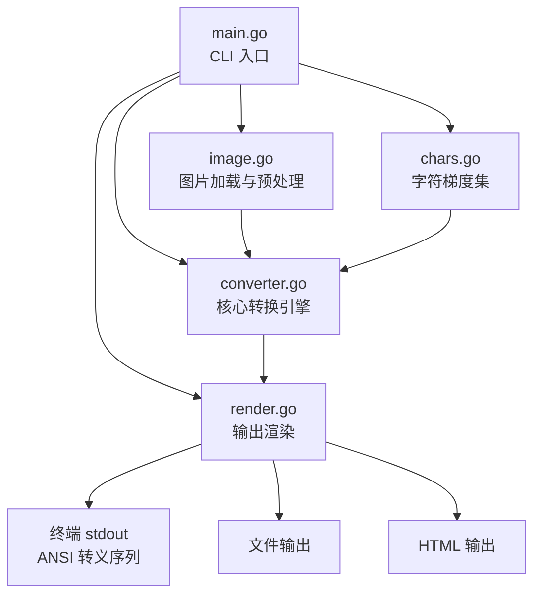
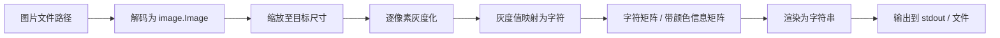

# AI.md — asciiart 项目架构与技术规划

## 1. 项目概述

**asciiart** 是一个用 Go 编写的命令行工具，将图片（PNG / JPEG / GIF / BMP / WebP 等常见格式）转换为字符画（ASCII Art），并在终端控制台中输出。项目模块名为 `asciiart`，Go 版本 `1.25.0`。

### 核心目标

- 读取任意常见格式的图片文件
- 将图片像素映射为密度不同的字符，在终端中「画」出原图
- 支持灰度输出与真彩色输出
- 提供灵活的 CLI 参数控制输出效果

---

## 2. 技术栈

| 层面 | 技术选择 | 说明 |
|---|---|---|
| 语言 | Go 1.25.0 | 见 [`go.mod`](go.mod) |
| 图片解码 | `image` / `image/png` / `image/jpeg` / `image/gif` / `golang.org/x/image` | 标准库 + 扩展库支持 WebP、BMP 等 |
| CLI 框架 | `flag` 标准库 或 `spf13/cobra` | 初期用 `flag`，参数变多后可迁移到 cobra |
| 终端兼容 | 纯 ANSI 转义序列 + Windows 虚拟终端 | 跨平台终端颜色支持 |
| 测试 | `testing` 标准库 | 单元测试 + 表驱动测试 + 黄金文件测试 |

---

## 3. 项目目录结构

```
asciiart/
├── main.go                    # 入口：解析 CLI 参数，调用核心逻辑
├── converter.go               # 核心转换：图片 → 字符矩阵
├── image.go                   # 图片加载、解码、预处理（缩放、灰度化）
├── render.go                  # 输出渲染：控制台 ANSI 输出、HTML 输出
├── chars.go                   # 字符梯度集定义与映射逻辑
├── converter_test.go          # 核心转换逻辑单元测试
├── image_test.go              # 图片预处理单元测试
├── render_test.go             # 渲染输出单元测试
├── chars_test.go              # 字符集映射单元测试
├── go.mod
├── go.sum
├── README.md
├── AI.md                      # 本文件
└── testdata/                  # 测试用图片与黄金文件
    ├── sample.png
    ├── sample.jpg
    └── golden/
        ├── default.txt
        ├── colored.txt
        └── custom_ramp.txt
```

### 结构说明

采用**扁平包结构**（全部在 `main` 包下），原因：
- 项目规模小，不涉及可复用库
- 减少包间耦合与导入复杂度
- 符合 Go 小型 CLI 工具的惯例

若后续需要作为 library 对外暴露 API，可将核心逻辑迁移到 `internal/ascii/` 或 `pkg/ascii/` 包中。

---

## 4. 架构设计

### 4.1 模块关系图



### 4.2 数据流



---

## 5. 模块详细设计

### 5.1 [`main.go`](main.go) — CLI 入口

**职责**：解析命令行参数，编排调用流程。

**CLI 参数设计**：

| 参数 | 短标志 | 类型 | 默认值 | 说明 |
|---|---|---|---|---|
| `--width` | `-w` | int | 80 | 输出宽度（字符列数） |
| `--color` | `-c` | bool | false | 启用真彩色输出（24-bit ANSI） |
| `--invert` | `-i` | bool | false | 反转亮度映射 |
| `--ramp` | `-r` | string | `standard` | 字符梯度预设名 |
| `--custom-ramp` | | string | — | 自定义字符梯度字符串（从暗到亮） |
| `--output` | `-o` | string | — | 输出到文件路径（默认 stdout） |
| `--html` | | bool | false | 以 HTML 格式输出 |
| `--aspect` | | float64 | 0.5 | 字符宽高比修正系数 |

**执行流程**：
1. 解析 `flag`
2. 校验必选参数（图片路径作为 positional argument）
3. `LoadImage(path)` 加载图片
4. `Preprocess(img, width, aspectRatio)` 缩放与灰度化
5. `ConvertToASCII(gray, ramp, invert)` 转换为字符矩阵
6. 若 `--color`：保留原始颜色信息，生成带 ANSI 码的字符串
7. `Render(result, opts)` 输出到目标

### 5.2 [`image.go`](image.go) — 图片加载与预处理

**导出函数**：

```go
// LoadImage 从文件路径加载图片，支持 PNG/JPEG/GIF/BMP/WebP
func LoadImage(path string) (image.Image, error)

// Preprocess 将图片缩放至目标宽度并转换为灰度图
// aspectRatio: 字符宽高比修正（终端字符通常高约为宽的2倍，默认 0.5）
func Preprocess(img image.Image, targetWidth int, aspectRatio float64) *image.Gray

// ToGrayscaleMatrix 将 image.Image 转换为二维灰度值矩阵 [0,255]
func ToGrayscaleMatrix(img image.Image) [][]uint8

// ToColorMatrix 将 image.Image 转换为二维 RGB 颜色矩阵
func ToColorMatrix(img image.Image) [][]color.RGBA
```

**灰度化公式**（ITU-R BT.601 亮度公式）：
```
Gray = 0.299*R + 0.587*G + 0.114*B
```

**缩放算法**：
- 使用 `golang.org/x/image/draw` 的 `draw.ApproxBiLinear.Scale()` 进行高质量缩放
- 目标高度 = `targetWidth * aspectRatio * (原图高度 / 原图宽度)`

### 5.3 [`chars.go`](chars.go) — 字符梯度集

**导出内容**：

```go
// CharRamp 字符梯度（从暗到亮排列）
type CharRamp []rune

// 预设梯度
var RampShort    CharRamp  // "@%#*+=-:. "    (10 级)
var RampStandard CharRamp  // "@%#*+=-:. " 等价，常用简单梯度
var RampDetailed CharRamp  // "$@B%8&WM#*oahkbdpqwmZO0QLCJUYXzcvunxrjft/\\|()1{}[]?-_+~<>i!lI;:,\"^`'. "  (70 级)
var RampBlocks   CharRamp  // "█▓▒░ "        (Unicode 块元素，5 级)

// GetRamp 根据名称获取预设梯度
func GetRamp(name string) (CharRamp, error)

// NewCustomRamp 从字符串创建自定义梯度
func NewCustomRamp(s string) CharRamp

// MapGrayToChar 将灰度值 [0,255] 映射为梯度中的字符
// invert: true 时反转映射（亮→暗）
func (r CharRamp) MapGrayToChar(gray uint8, invert bool) rune
```

**映射公式**：
```
index = gray * (len(ramp) - 1) / 255
if invert: index = (len(ramp) - 1) - index
return ramp[index]
```

### 5.4 [`converter.go`](converter.go) — 核心转换引擎

**导出函数**：

```go
// ASCIIResult 字符画转换结果
type ASCIIResult struct {
    Lines   []string          // 每行字符串（纯字符，无颜色）
    Width   int
    Height  int
}

// ColorResult 带颜色信息的转换结果
type ColorResult struct {
    Lines   []string          // 每行含 ANSI 转义序列的字符串
    Width   int
    Height  int
}

// Convert 灰度模式转换：图片路径 → ASCII 字符画
func Convert(path string, opts ConvertOptions) (*ASCIIResult, error)

// ConvertColor 彩色模式转换：图片路径 → 彩色 ASCII 字符画
func ConvertColor(path string, opts ConvertOptions) (*ColorResult, error)

// ConvertOptions 转换选项
type ConvertOptions struct {
    Width       int
    Ramp        CharRamp
    Invert      bool
    AspectRatio float64
}
```

**实现逻辑**：
1. 调用 [`LoadImage`](image.go) 加载图片
2. 调用 [`Preprocess`](image.go) 缩放并灰度化
3. 遍历灰度图每个像素，调用 `CharRamp.MapGrayToChar()` 映射字符
4. 若为彩色模式，同时记录原始颜色，生成 ANSI 转义序列
5. 组装 `ASCIIResult` / `ColorResult`

### 5.5 [`render.go`](render.go) — 输出渲染

**导出函数**：

```go
// RenderToWriter 将 ASCIIResult 渲染到 io.Writer
func RenderToWriter(w io.Writer, result *ASCIIResult) error

// RenderColorToWriter 将 ColorResult 渲染到 io.Writer
func RenderColorToWriter(w io.Writer, result *ColorResult) error

// RenderToHTML 将 ColorResult 渲染为 HTML 字符串
func RenderToHTML(result *ColorResult) string
```

**ANSI 真彩色格式**：
```
\033[38;2;{R};{G};{B}m{char}\033[0m
```
每个字符独立设置前景色，行末重置。

**HTML 输出格式**：
```html
<!DOCTYPE html>
<html>
<head><style>
  pre { line-height: 1; font-family: monospace; }
  span { /* inline */ }
</style></head>
<body><pre>
<span style="color:rgb(R,G,B)">char</span>...
</pre></body>
</html>
```

---

## 6. 实现计划

### Phase 1：最小可行产品（MVP）

| 步骤 | 文件 | 内容 |
|---|---|---|
| 1 | [`chars.go`](chars.go) | 定义 `CharRamp` 类型、预设梯度、`MapGrayToChar()` 映射函数 |
| 2 | [`image.go`](image.go) | 实现 `LoadImage()`（支持 PNG/JPEG）、`Preprocess()` 灰度缩放 |
| 3 | [`converter.go`](converter.go) | 实现 `Convert()` 灰度转换核心逻辑 |
| 4 | [`render.go`](render.go) | 实现 `RenderToWriter()` 纯文本输出 |
| 5 | [`main.go`](main.go) | 串联流程，`-w` `-r` `-i` `-o` 参数支持 |

### Phase 2：彩色输出

| 步骤 | 文件 | 内容 |
|---|---|---|
| 6 | [`image.go`](image.go) | 添加 `ToColorMatrix()` 保留颜色信息 |
| 7 | [`converter.go`](converter.go) | 实现 `ConvertColor()` |
| 8 | [`render.go`](render.go) | 实现 ANSI 真彩色渲染、Windows 虚拟终端兼容 |
| 9 | [`main.go`](main.go) | 添加 `--color` 参数 |

### Phase 3：扩展输出

| 步骤 | 文件 | 内容 |
|---|---|---|
| 10 | [`render.go`](render.go) | 实现 `RenderToHTML()` |
| 11 | [`main.go`](main.go) | 添加 `--html` 参数 |
| 12 | [`image.go`](image.go) | 扩展 WebP/BMP/GIF 支持（`golang.org/x/image`） |

### Phase 4：健壮性与测试

| 步骤 | 文件 | 内容 |
|---|---|---|
| 13 | `*_test.go` | 各模块单元测试 |
| 14 | `testdata/` | 测试图片与黄金文件 |

---

## 7. 测试策略

### 7.1 单元测试

- **`chars_test.go`**：表驱动测试验证 `MapGrayToChar()` 映射正确性（边界值 0、128、255），验证 `GetRamp()` 返回各预设梯度
- **`image_test.go`**：验证 `LoadImage()` 对 PNG/JPEG 的解码，验证 `Preprocess()` 输出尺寸正确、灰度值在 [0,255] 范围
- **`converter_test.go`**：使用小尺寸测试图片，验证 ASCII 输出行数/列数正确
- **`render_test.go`**：捕获 `bytes.Buffer` 输出，验证 ANSI 转义序列格式正确

### 7.2 黄金文件测试（Golden File Tests）

将已知测试图片的预期输出保存为 `testdata/golden/*.txt`，测试时对比实际输出与黄金文件是否一致。若算法有预期内的变化，使用 `-update` 标志更新黄金文件。

### 7.3 边界情况

| 场景 | 预期行为 |
|---|---|
| 图片宽度为 0 | 返回错误 |
| 自定义梯度字符串为空 | 返回错误 |
| 图片路径不存在 | 返回明确错误信息 |
| 超大图片（>10000px） | 正常处理（Go image 库流式解码） |
| 透明 PNG | 透明像素视为白色背景 |
| 输出宽度 = 1 | 正常输出单列字符 |
| Windows 控制台 | 需调用 `windows.SetConsoleMode()` 启用虚拟终端处理 |

---

## 8. 关键设计决策与注意事项

### 8.1 字符宽高比修正

终端字符通常高约为宽的 2 倍，因此缩放图片时高度需乘以 `aspectRatio`（默认 0.5）来修正视觉比例。该值可通过 `--aspect` 参数由用户调整。

### 8.2 ANSI 颜色性能

彩色模式下每个字符都包裹在 ANSI 转义序列中，输出字符串会急剧膨胀。对宽度=200 的图片，每行约 200 × 20 bytes ≈ 4KB，200行共 ~800KB。这在现代终端中无性能问题，但需注意：
- 使用 `strings.Builder` 预分配容量
- 避免逐字符 `fmt.Fprint`，应批量写入

### 8.3 GIF 动图支持

初期仅处理 GIF 的第一帧。后续可扩展为播放动画（使用 ANSI 光标移动重绘）。

### 8.4 外部依赖管理

```
go mod tidy       # 自动管理依赖
go mod download   # 下载依赖
```

必要的第三方依赖：
- `golang.org/x/image` — WebP、BMP 解码支持

---

## 9. 未来可扩展方向（不在当前范围）

- [ ] GIF 动画播放（逐帧渲染 + 光标重绘）
- [ ] 视频文件支持（逐帧提取 + 实时播放）
- [ ] 摄像头实时采集
- [ ] 更多输出格式：SVG、JSON
- [ ] 边缘检测增强模式（Sobel / Canny）
- [ ] 误差扩散抖动（Floyd-Steinberg dithering）提升灰度表现
- [ ] 终端宽度自动检测（`golang.org/x/term`）
- [ ] 作为 Go library 对外暴露 API（迁移到 `pkg/asciiart/`）
- [ ] WebAssembly 编译，浏览器端运行

---

## 10. AI 开发指引

1. **严格遵循 Go 惯用法**：导出符号大写开头，错误用 `error` 返回值，避免 `panic`。
2. **每次只实现一个 Phase**：按 Phase 1 → 2 → 3 → 4 顺序进行，每个 Phase 完成后确保编译通过、测试通过。
3. **先写测试再写实现**（TDD）：尤其 `chars.go` 和 `image.go` 中的纯函数非常适合表驱动测试。
4. **使用 `go fmt` 和 `go vet`**：每次修改后格式化代码并检查问题。
5. **不要引入不必要的第三方依赖**：仅在标准库无法满足时引入（如 WebP 支持需要 `golang.org/x/image`）。
6. **保持单文件 ≤ 300 行**：如果某个文件过大，考虑拆分为更细粒度的文件。
7. **所有公共函数必须有文档注释**：格式为 `// FunctionName 功能描述`。
8. **优先使用标准库的 `log/slog` 进行日志输出**（Go 1.21+ 结构化日志），调试信息输出到 `stderr`，确保字符画输出到 `stdout` 不被污染。
